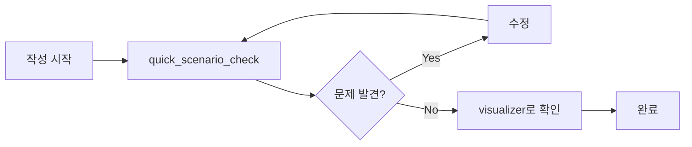
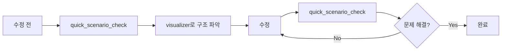

# 🎯 Cupid 시나리오 개발 도구 모음

Cupid 시나리오 파일의 **노드 끊김**, **유령 노드**, **깨진 참조**를 한눈에 파악하고 해결할 수 있는 도구 세트입니다.

---

## 📦 포함된 도구

| 도구 | 용도 | 실행 시간 |
|------|------|----------|
| **quick_scenario_check.ps1** | 시나리오 파일 검증 | ~2초 |
| **scenario_visualizer.ps1** | 플로우 차트 생성 | ~3초 |
| **scenario_analyzer.ps1** | 상세 분석 리포트 | ~5초 |

---

## 🚀 빠른 시작

### 1. 전체 시나리오 검증

```powershell
cd c:\workspace\cupid\scripts
.\quick_scenario_check.ps1
```

**출력 예시:**
```
[day1_2_lunch.js]
  Total Nodes: 118
  Referenced Nodes: 171

  Ghost Nodes (unreferenced):
    - rooftop_comfortable

  Dead Ends (no next node):
    - lunch_seoyeon_high
    - rooftop_1_2
```

### 2. 플로우 차트 생성

```powershell
.\scenario_visualizer.ps1 -FileName "day1_1_morning.js" -Simplified
```

생성된 `scenario_flow_*.md` 파일을 VS Code에서 열어보세요!

---

## 📊 현재 시나리오 상태 (2026-01-29)

### 전체 통계

```
총 파일: 9개 (ko 시나리오)
총 노드: 766개
평균 파일당 노드: 85개
```

### 발견된 문제

| 문제 유형 | 개수 | 심각도 |
|-----------|------|--------|
| Dead Ends | 234 | ⚠️ 확인 필요 |
| Ghost Nodes | 2 | 🔴 수정 필요 |
| Broken References | 3 | 🔴 즉시 수정 |

### 파일별 상세

| 파일 | 노드 | Dead Ends | Ghost | Broken |
|------|------|-----------|-------|--------|
| day1_1_morning.js | 97 | 29 | 0 | 0 |
| day1_2_lunch.js | 118 | 38 | 1 | 0 |
| day1_3_afterschool.js | 125 | 33 | 0 | 1 |
| day1_4_night.js | 34 | 14 | 1 | 0 |
| day2_1_morning.js | 50 | 9 | 0 | 0 |
| day2_2_lunch.js | 146 | 43 | 0 | 0 |
| day2_3_afterschool.js | 117 | 57 | 0 | 0 |
| day2_4_night.js | 49 | 6 | 0 | 1 |
| day3_1_morning.js | 30 | 5 | 0 | 1 |

---

## 🔍 문제 유형 설명

### 🔴 Dead Ends (끊긴 노드)

**설명:** `next` 속성이 없어서 게임 진행이 멈추는 노드

**원인:**
- `next` 속성을 깜빡 추가
- 의도적인 종료 노드 (괜찮음)

**해결:**
```javascript
// ❌ Before
"scene_end": {
    name: "서연",
    text: "끝?"
}

// ✅ After
"scene_end": {
    name: "서연",
    text: "끝?",
    next: "lunch_time"  // 다음 씬으로 전환
}
```

### 👻 Ghost Nodes (유령 노드)

**설명:** 어떤 노드에서도 참조하지 않아서 플레이어가 절대 볼 수 없는 노드

**원인:**
- 미사용 코드 방치
- 연결을 깜빡함

**해결:**
```javascript
// Option 1: 연결 추가
"previous_node": {
    next: "ghost_node"  // ✅
}

// Option 2: 삭제
// "ghost_node": { ... }  // ❌ 삭제
```

### 🔗 Broken References (깨진 참조)

**설명:** 존재하지 않는 노드를 참조 (게임 크래시 위험!)

**원인:**
- 오타
- 노드 삭제 후 참조 미수정

**해결:**
```javascript
// ❌ Before
"scene_a": {
    next: "scne_b"  // 오타!
}

// ✅ After
"scene_a": {
    next: "scene_b"  // 올바른 이름
}
```

---

## 📝 작업 흐름 (Workflow)

### 새 시나리오 작성



### 기존 시나리오 수정



---

## 🛠️ 도구 상세 설명

### quick_scenario_check.ps1

**목적:** 빠른 검증

**옵션:**
```powershell
# 전체 검증
.\quick_scenario_check.ps1

# 날짜별 패턴
.\quick_scenario_check.ps1 -Pattern "day*.js"

# 특정 파일
.\quick_scenario_check.ps1 -Pattern "day1_2_lunch.js"
```

**출력:**
- 총 노드 수
- Ghost Nodes 목록
- Dead Ends 목록
- Broken References 목록
- `all_nodes.txt` 생성

---

### scenario_visualizer.ps1

**목적:** 시각화

**옵션:**
```powershell
# 전체 노드 표시
.\scenario_visualizer.ps1 -FileName "day1_1_morning.js"

# 간소화 모드 (추천!)
.\scenario_visualizer.ps1 -FileName "day1_1_morning.js" -Simplified
```

**출력:**
- `scenario_flow_*.md` 파일
- Mermaid 플로우 차트
- 통계 정보

**차트 범례:**
- 🟢 녹색 = 시작 노드
- 🟡 노란색 = 선택지
- 🔵 파란색 = 호감도 분기
- 🟣 보라색 = 입력
- 🔴 분홍색 = 종료/씬 전환

---

### scenario_analyzer.ps1

**목적:** 상세 분석 (개발 중)

**옵션:**
```powershell
.\scenario_analyzer.ps1 -ShowDetails
.\scenario_analyzer.ps1 -GenerateGraph
```

---

## 📚 문서

| 문서 | 내용 |
|------|------|
| **QUICKSTART.md** | 빠른 시작 가이드 |
| **README_SCENARIO_DEV.md** | 시나리오 작성 규칙, 명명 규칙, 문제 해결 |
| **이 파일 (README.md)** | 전체 개요 |

---

## 💡 팁

### 1. 작업 전 항상 검증

```powershell
.\quick_scenario_check.ps1
```

### 2. Dead End 판별

대부분의 Dead End는 다음 씬으로 전환하는 노드입니다:
- `lunch_time` - 점심 시간으로
- `after_school_start` - 방과 후로
- `night_*` - 밤으로
- `day*_end` - 다음 날로

**이런 노드들은 문제 없음!**

### 3. 복잡한 파일은 간소화 모드로

```powershell
.\scenario_visualizer.ps1 -FileName "day2_2_lunch.js" -Simplified
```

### 4. PowerShell Alias 설정 (선택)

```powershell
# $PROFILE에 추가
Set-Alias scheck "c:\workspace\cupid\scripts\quick_scenario_check.ps1"
Set-Alias sviz "c:\workspace\cupid\scripts\scenario_visualizer.ps1"

# 사용
scheck
sviz -FileName "day1_1_morning.js" -Simplified
```

---

## 🐛 트러블슈팅

### "스크립트 실행 불가" 오류

```powershell
powershell -ExecutionPolicy Bypass -File .\quick_scenario_check.ps1
```

### 차트가 안 보임

1. **VS Code:** `Ctrl + Shift + V` (미리보기)
2. **확장 설치:** "Markdown Preview Mermaid Support"
3. **온라인:** https://mermaid.live

### 한글 깨짐

파일 인코딩이 UTF-8인지 확인하세요.

---

## 🎯 우선순위

**즉시 수정:**
1. 🔴 Broken References (3개)
2. 🔴 Ghost Nodes (2개)

**검토 필요:**
3. ⚠️ Dead Ends (234개) - 대부분 정상이지만 확인 권장

---

## 📈 개선 로드맵

### Phase 1: 검증 (✅ 완료)
- [x] quick_scenario_check.ps1
- [x] scenario_visualizer.ps1
- [x] 문서화

### Phase 2: 자동화 (계획)
- [ ] Pre-commit hook 추가
- [ ] CI/CD에 검증 통합
- [ ] 자동 리포트 생성

### Phase 3: 고급 기능 (계획)
- [ ] 인터랙티브 그래프
- [ ] 노드 검색 기능
- [ ] 호감도 시뮬레이션

---

## 🤝 기여

버그나 개선 아이디어가 있으면:
1. Issue 생성
2. PR 제출
3. 팀원에게 문의

---

## 📞 지원

**문제가 있으면:**
1. QUICKSTART.md 확인
2. README_SCENARIO_DEV.md 확인
3. 도구 재실행
4. 팀원에게 문의

---

## 🎉 결론

이 도구들로 Cupid 시나리오를 더 쉽게 관리하고, 버그를 조기에 발견하고, 구조를 명확하게 파악할 수 있습니다!

**Happy Scenario Development! 🚀✨**

---

**Last Updated:** 2026-01-29  
**Version:** 1.0.0  
**Author:** GitHub Copilot
